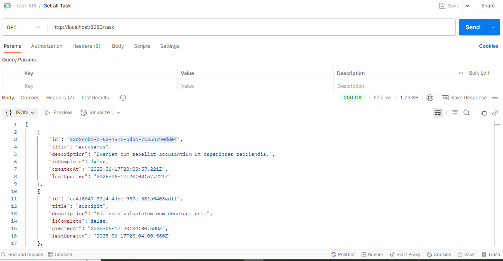
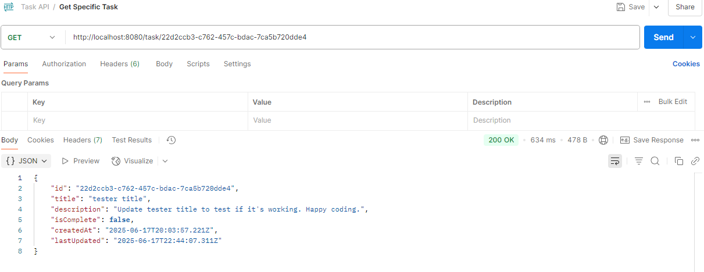
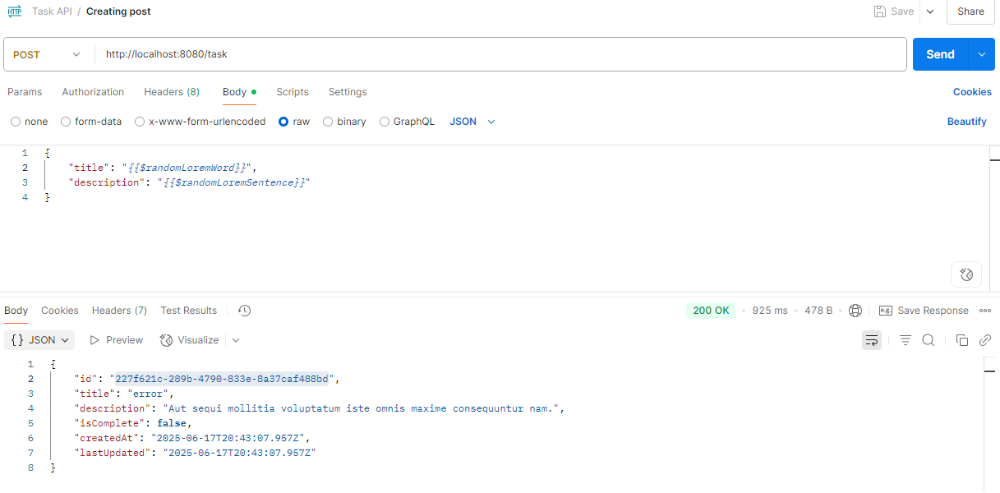
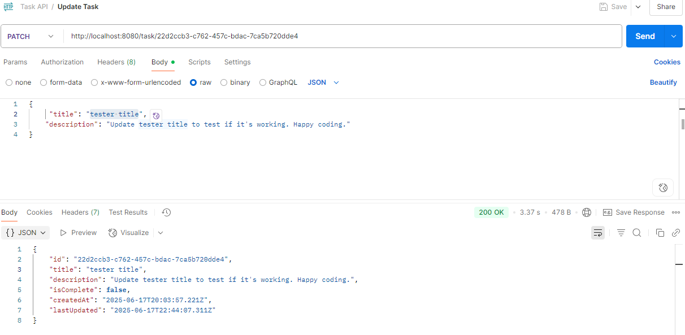
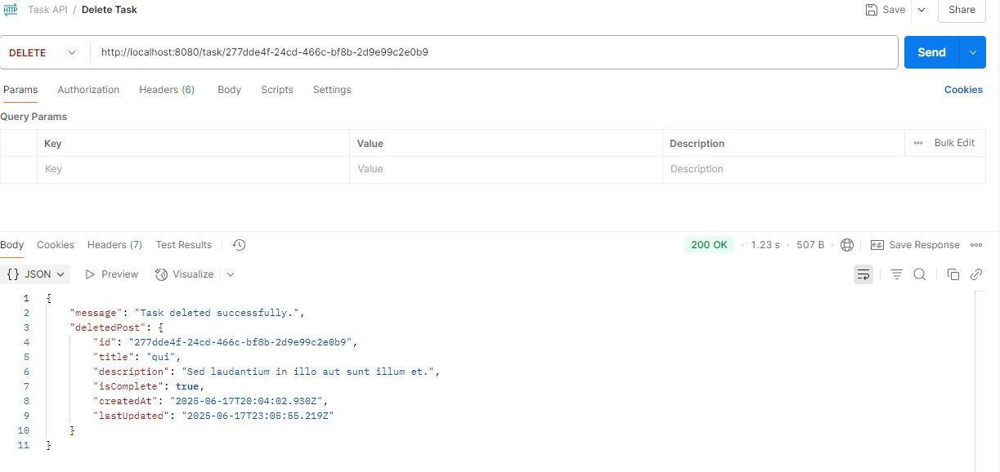

# Task API with Express, TypeScript & Prisma

This is a RESTful Task API built using:

- Express.js (web framework)
- TypeScript (type safety)
- Prisma (ORM for database)
- Middlewares (validation)
- Controllers
- Routes

## Features

- Get all incomplete tasks
- Get a specific task by ID
- Create a new task
- Update a task
- Soft delete a task (marks as complete)
- Middleware for input validation, routing and controllers.

## Example Endpoints

| Method | Endpoint    | Description        |
| ------ | ----------- | ------------------ |
| GET    | `/task`     | Get all tasks      |
| GET    | `/task/:id` | Get a task by Id   |
| POST   | `/task`     | Create a new task  |
| PATCH  | `/task/:id` | Update task by Id  |
| DELETE | `/task/:id` | Soft delete a task |

## CRUD Endpoint Images

### Get all Tasks



### Get a Specific Task



### Create a New Task



### Update a Task



### Delete a Task



## Setup Instructions

1. Clone the repository or download the ZIP.

2. Install dependencies:

   ```bash
   npm install && npm run build
   ```

3. Generate Prisma client:

   ```bash
   npx prisma generate
   ```

4. Start the server:

   ```bash
   npm run dev
   ```

   Made by [Brian Njoroge](https://github.com/briannjoroge/task_api_ts) with 💓💫
